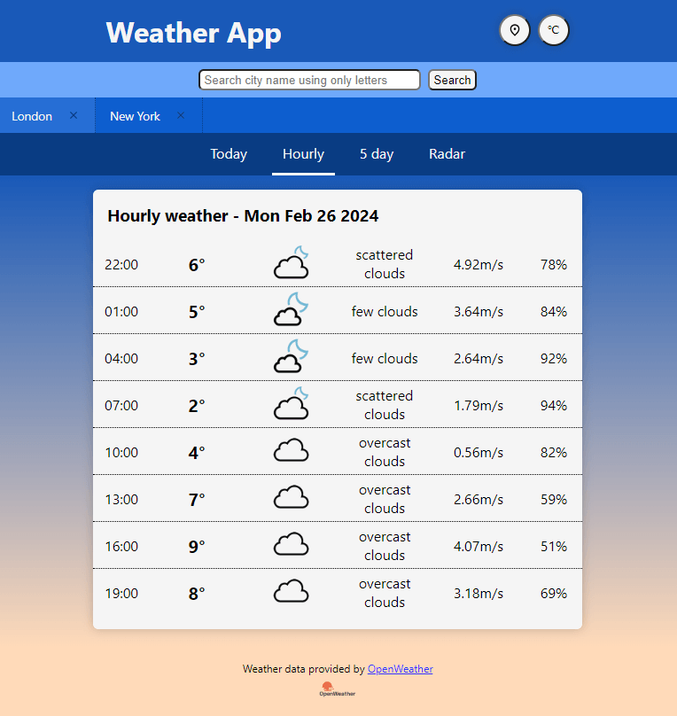

# React Weather Application  

Search the latest weather conditions and forecasts by city name or based on user position. Get a five day overview of forecast information, including hourly and radar data.

## Description


This weather app let users get information about the weather conditions in their location or somewhere else in the world. The project started out with the motivation for an easy way for users to quickly see an overview of todays weather with hourly forecast data, using an weather api. With further developing of the app now includes the following:

- Get current position using Geolocation API in browser.
- Get forecast information over a five day interval using the weather-API from OpenWeatherMap. Show todays weather, week overview and hourly updates for today.
- Search for weather data in a specific location using the Geocoding API from OpenWeatherMap.
- Show a forecast radar image for location using OpenWeatherMaps different radar-layers over an interactive map from Leaflet.
- List of search history for better ux and save it in local storage to persist list-state over rerenders.
- Utilize GeoDB-Cities-api to give autocomplete suggestions for city names when typing in the search bar.

With this project I set out to further my knowledge of react and how to use it effectively when working with an API. The goal after that was to make a useful site for users to quickly check out the weather in their location, using the browsers geolocation when they first enter the site. Then they can seamlessly switch to another location by searching for it or select the city name in the list from the search history. There's autocomplete to help speed up the search process with suggestions for city names, when users start to type in the search input field.

<style>
  .images-container {
    display: flex; 
    justify-content: center;
    align-items: center;
    gap: 10px; 
    width: 100%
  }

  .screenshot-images {
    width: 33%
  }

  @media screen and (max-width: 600px) {
    .images-container {
      flex-direction: column;
    }

    .screenshot-images {
      width: 100%
    }
  }
</style>

<div class="images-container">
  
  
  
</div>

<!-- 

 -->

## Getting Started

### Dependencies

- Node.js (version 18+).

### Installing

- Clone/download repository.
- Modify the template file .env.example with your own API keys and rename the file to .env
- Install dependencies

```
npm install
```

### Executing program

- In project root folder

```
npm start
```

## Launch

Coming soon.

## Acknowledgments

- [OpenWeather](https://openweathermap.org/)
- [GeoDB Cities](https://rapidapi.com/wirefreethought/api/geodb-cities/details)
